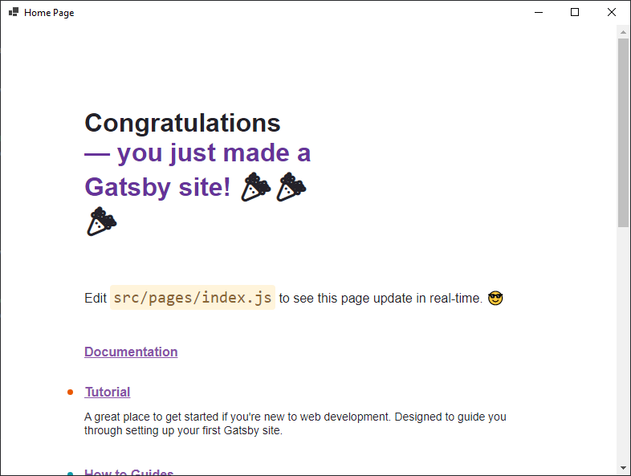

# Gatsby example

Create new [Gatsby](https://www.gatsbyjs.com/) project with

```
npm init gatsby
```

Download [Wrapper.cs](Wrapper.cs) and [[project].csproj]([project].csproj) to the project directory.

Open `[project].csproj` and change

```xml
<Content Include="wwwroot\**">
    <CopyToOutputDirectory>Always</CopyToOutputDirectory>
</Content>
```

To

```xml
<Content Include="public\**">
    <CopyToOutputDirectory>Always</CopyToOutputDirectory>
</Content>
```

Open `Wrapper.cs` and change

```cs
var blazor = new BlazorWebView()
{
    Dock = DockStyle.Fill,
    HostPage = @"wwwroot\index.html",
    Services = (new ServiceCollection()).AddBlazorWebView().BuildServiceProvider()
};
```

To

```cs
var blazor = new BlazorWebView()
{
    Dock = DockStyle.Fill,
    HostPage = @"public\index.html",
    Services = (new ServiceCollection()).AddBlazorWebView().BuildServiceProvider()
};
```

Run the program

```
npm run build
dotnet run
```

## Result

