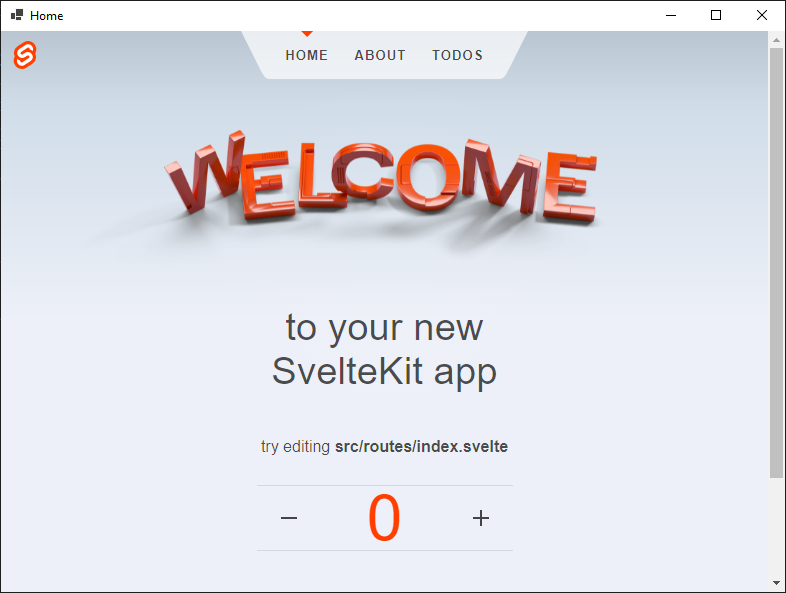

# SvelteKit example

In your project directory, use NPM to create a [SvelteKit](https://kit.svelte.dev/) app

```
$ npm init svelte@next .
```

Install the static adapter with

```
npm i -D @sveltejs/adapter-static@next
```

Edit `svelte.config.js` to enable static site generation

```js
// svelte.config.js
import adapter from '@sveltejs/adapter-static';

export default {
	kit: {
		adapter: adapter({
            // Set build path to wwwroot
			pages: 'wwwroot',
			assets: 'wwwroot',

            // Uncomment to switch to SPA mode
            // fallback: index.html
		})
	}
};
```

Download [Wrapper.cs](Wrapper.cs) and [[project].csproj]([project].csproj) to your project directory.

Run the program

```
npm run build
dotnet run
```

## Result

